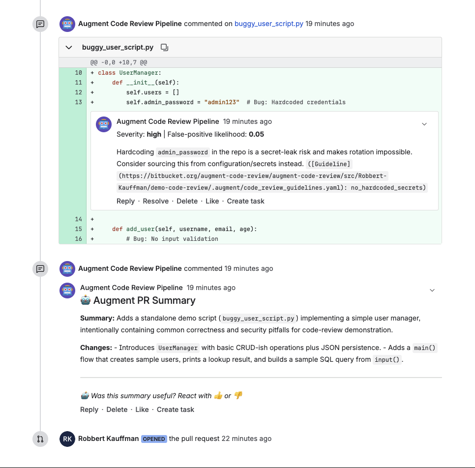

# Code Review using Auggie CLI for non-GitHub platforms

This repository contains examples of how to setup Auggie CLI for code review on the following platforms:
- Bitbucket
- Azure DevOps
- GitLab

## Requirements

Customers need to have non-interactive CLI enabled, as well as access to the Code Review Model. See [this PR](https://github.com/augmentcode/augment/pull/43028) for which feature flags to use.

## Instructions

Instructions for each platform are in their respective folders, and include an example pipeline:
- [Bitbucket](./bitbucket/README.md)
- [Azure DevOps](./azure-dev-ops/README.md)
- [GitLab](./gitlab/README.md)

You can use the included [demo_buggy_script.py](./demo_buggy_script.py) to test the code review functionality.

## Limitations

- No metrics/analytics. Customers that need this can use the APIs of the platform to pull data on thumbs up/down or similar.
- No detection max limit of diff. This can be added but adds complexity to the pipeline. Awaiting Engineering to provide APIs for processing diffs and handling this. TBD.

## Example PRs with reviews

You can see examples of the Auggie CLI and pipelines in action in the following pull requests. For access to Bitbucket & Azure DevOps, ask Jay.

- [Bitbucket](https://bitbucket.org/augment-code-review/augment-code-review/pull-requests/8)
- [Azure DevOps](https://dev.azure.com/saaugmentcode/augment-code-review/_git/augment-code-review/pullrequest/28)
- [GitLab](https://gitlab.com/sa5682905/augment-code-review/-/merge_requests/3)
