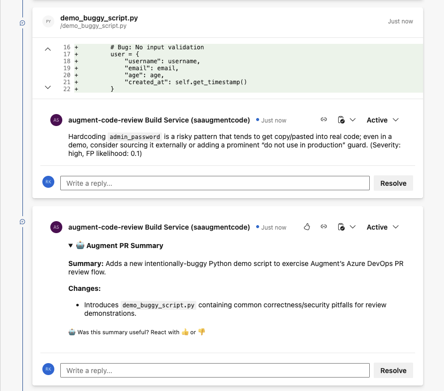

# Augment Code Review Setup for Azure DevOps

This guide walks you through how to set up the **Auggie CLI** with Azure DevOps for automatically generating code review comments after a pull request.



## Generate an Augment Token

Create an [Augment Service Account](https://docs.augmentcode.com/cli/automation/service-accounts) that will be used for authenticating to Augment in the Code Review Pipeline. Service accounts are recommended as they are not tied to individual user accounts. Note that service accounts are only available to Enterprise plan customers and *can only be managed by the Administrator* of the Enterprise Plan.

To create one:
* Navigate to: https://app.augmentcode.com/settings/service-accounts
* Click the `New service account` button, and enter a name (e.g. Augment Code Review) and an optional description.
* Click the `Add API token` button, and enter a name (e.g. GitLab).
* Download the JSON by clicking the `JSON` button. This will be used later when defining the Pipeline Variables in Azure DevOps.

*Alternatively, you can use a personal token by running `auggie login` followed by `auggie tokens print` on your local machine.*

## Add the Pipeline YAML to Your Repository

1. In your repository, create a file named `azure-pipelines.yml` at the root (or use any name you prefer).
2. Paste the complete pipeline YAML content into that file.
3. Commit and push the file to your repository.

## Create the Pipeline in Azure DevOps

1. Navigate to **Pipelines** → **Pipelines** → **New pipeline**
2. Select **Azure Repos Git** 
3. Choose the repository where you committed `azure-pipelines.yml`
4. When asked to configure your pipeline, select **Existing Azure Pipelines YAML file**
5. Select the YAML file path (e.g., `/azure-pipelines.yml`)
6. Click **Continue** and then **Save** (do not run yet)

## Configure the Secret Authentication Token

This is critical for Auggie to authenticate:
1. Open the pipeline you just created
2. Click **Edit** in the top-right corner
3. Click the **Variables** button at the top-right
4. Click **New variable**
5. Configure the variable:
   * **Name**: `AUGMENT_SESSION_AUTH`  
   * **Value**: Paste the entire JSON object you downloaded from the `JSON` button
     * NOTE: if you are using the personal token method from `auggie tokens print` then copy ONLY the JSON object following `SESSION=`
   * **✓ Keep this value secret** (check this box)
6. Click **OK** and then **Save**

## Enable OAuth Token Access for PR Comments

**This step is essential** \- without it, the pipeline cannot post inline PR comments.

### Repository Settings (Most Reliable)

1. Go to **Project Settings** (gear icon in bottom-left)
2. Under **Repos**, select **Repositories**
3. Select your specific repository
4. Click the **Security** tab
5. Find **\[Your Project Name\] Build Service** in the user list
6. Set these permissions to **Allow**:
   * **Contribute**: Allow  
   * **Contribute to pull requests**: Allow

## Configure Branch Policies for Main Branch

**This step is essential** \- without it, the pipeline will not get triggered.

To correctly populate the necessary environment variables, such as the target branch and PR ID, and ensure the pipeline is triggered upon a Pull Request (PR), you *must* configure the pipeline via a Branch Policy. Attempting to trigger the pipeline using conditional logic within the pipeline YML *will not* work because the required environment variables will not be set.

### Set Up Build Validation Policy

1. Go to **Repos** → **Branches**
2. Find your **main** branch (or whichever branch you want to protect)
3. Click the **︙** (three dots) next to the branch name
4. Select **Branch policies**
5. Scroll down to **Build Validation**
6. Click **\+** (Add build policy)
7. Configure the build policy:
   * **Build pipeline**: Select your Auggie pipeline  
   * **Path filter**: Leave empty (applies to all files)  
   * **Trigger**: Automatic  
   * **Policy requirement**: Optional or Required (choose based on your needs)  
   * **Build expiration**: Set to a reasonable time (e.g., 12 hours)  
   * **Display name**: "Auggie Code Review" (or your preference)
8. Click **Save**

## Verify Agent Pool and Build Service Permissions

### Confirm Agent Pool

The YAML uses:
```
pool:
  vmImage: 'ubuntu-latest'
```

This requires:
* Microsoft-hosted agents (default for most Azure DevOps organizations)  
* Ubuntu environment (includes Python, Git, and Node.js support)

If using self-hosted agents, ensure they have:
* Node.js 22.x  
* Git

### Verify Build Service Account Permissions

1. Go to **Project Settings** → **Repositories** → **Security**
2. Find **\[Project Name\] Build Service (\[Organization Name\])**
3. Verify these permissions are set to **Allow**:
   * **Contribute to pull requests**: Allow  
   * **Read**: Allow  
   * **Contribute**: Allow

## Test with Your First PR

### Create a Test Pull Request

1. Create a new branch from main:
```shell
git checkout -b test-auggie-review
```
2. Make a small code change (e.g., modify a Python or JavaScript file)
3. Commit and push the change:
```shell
git add .
git commit -m "Test Auggie review pipeline"
git push origin test-auggie-review
```
4. Create a Pull Request in Azure DevOps targeting the **main** branch

### Expected Pipeline Behavior

The pipeline should automatically trigger and execute these steps:

1. **Validate Augment authentication token** \- Confirms `AUGMENT_SESSION_AUTH` is set  
2. **Install Auggie** \- Installs the Auggie CLI via npm  
3. **Generate PR diff** \- Creates `pr.diff` comparing source and target branch  
4. **Perform Code Review on PR using Auggie** \- Uses ADO MCP to retrieve additional PR metadata and post comments

### Check the Results

After the pipeline completes:
* **PR Comments**: Look for inline comments on changed files  
* **Summary Comment**: Check for a top-level summary comment  
* **Pipeline Logs**: Review logs if something doesn't work as expected

## Troubleshooting

### Pipeline doesn't trigger on PRs

**Check:**
* Branch policies are configured for the target branch  
* The build validation policy is set to "Automatic"

### No inline PR comments appear

**Check:**
* `AUGMENT_SESSION_AUTH` variable is set as a secret  
* OAuth token access is enabled (Part 5\)  
* Build service has "Contribute to pull requests" permission  
* Pipeline logs show successful API calls (look for "Posted thread" messages)

### Auggie authentication fails

**Check:**
* Token was copied correctly from `auggie tokens print`  
* Token hasn't expired (generate a new one if needed)  
* Variable is marked as secret and saved

### Empty or invalid JSON from Auggie

**Check:**
* PR diff is not empty (pipeline logs show actual changes)  
* Auggie CLI version is recent (`auggie --version`)  
* Network connectivity from Azure DevOps agents to Augment servers

### Permission denied errors

**Check:**
* Build service account has proper repository permissions  
* OAuth token access is enabled for the pipeline  
* Repository is not archived or locked
