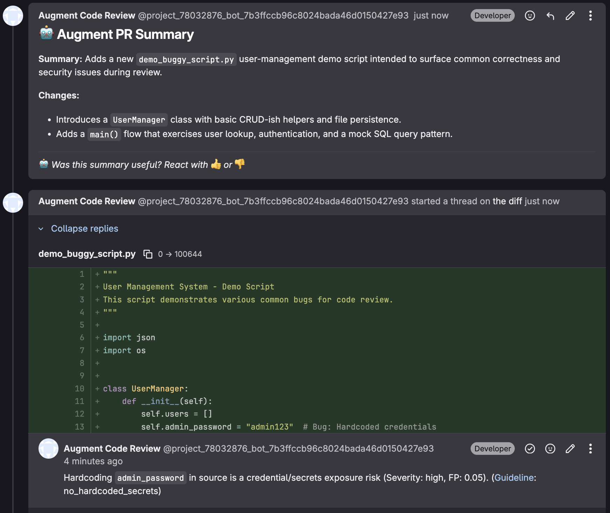

# Augment Code Review for GitLab

This guide walks you through how to set up the **Auggie CLI** with GitLab for automatically generating code review comments after a merge request.



---

## Prerequisites

### 1. Enable GitLab CI/CD & Configure Runners

Before running any pipelines, you must ensure your GitLab project is configured to use runners.

* **Shared Runners:** If you are using GitLab.com, shared runners are enabled by default. You can verify this in **Settings** > **CI/CD** > **Runners**.
* [**Self-Hosted Runners**](https://docs.gitlab.com/runner/install/): If your organization requires a self-hosted runner (e.g., for security compliance or VPC access), ensure the runner is registered and active in your **Settings** > **CI/CD** > **Runners**.

### 2. Retrieve your Auggie Token

Create an [Augment Service Account](https://docs.augmentcode.com/cli/automation/service-accounts) that will be used for authenticating to Augment in the Code Review Pipeline. Service accounts are recommended as they are not tied to individual user accounts. Note that service accounts are only available to Enterprise plan customers and *can only be managed by the Administrator* of the Enterprise Plan.

To create one:
* Navigate to: https://app.augmentcode.com/settings/service-accounts
* Click the `New service account` button, and enter a name (e.g. Augment Code Review) and an optional description.
* Click the `Add API token` button, and enter a name (e.g. GitLab).
* Copy the generated token by clicking the `Copy Token` button.

*Alternatively, you can use a personal token by running `auggie login` followed by `auggie tokens print` on your local machine.*

### 3. Create a Project Access Token in GitLab

Create a [Project Access Token](https://docs.gitlab.com/ee/user/project/settings/project_access_tokens.html) in GitLab. Project Access Tokens are scoped to a specific project and are not tied to a user account.

To create one:
* Go to your GitLab project.
* Navigate to **Settings** > **Access Tokens**.
* Create a new token with the role `Developer` and the following scope:
    * `api` - Full API access (required for posting MR comments)
    * `read_repository` - Read repository content
* Set an appropriate expiration date and copy the generated token.

### 4. Add Auggie token & GitLab Access token to GitLab [CI/CD Variables](https://docs.gitlab.com/ee/ci/variables/)

You can use either project-level or group-level variables. Choose one.

* Option A. To use Project variables:
    * Go to your GitLab project.
    * Navigate to **Settings** > **CI/CD** > **Variables**.
* Option B. To use Group variables:
    * Go to your GitLab group.
    * Navigate to **Settings** > **CI/CD** > **Variables**.
* Add a new variable:
    * **Key:** `AUGMENT_SESSION_AUTH`
    * **Value:** *(Paste your token from step 2 here)*
    * **Masked and hidden variable:** Checked (Recommended to hide the secret in logs and Settings UI)
    * **Protect variable:** Optional, restricts to protected branches
* Add another variable:
    * **Key:** `GL_TOKEN`
    * **Value:** *(Paste your token from step 3 here)*
    * **Masked and hidden variable:** Checked (Recommended to hide the secret in logs and Settings UI)
    * **Protect variable:** Optional, restricts to protected branches

---

## Pipeline Configuration

Create or update the [`.gitlab-ci.yml`](https://docs.gitlab.com/ee/ci/yaml/gitlab_ci_yaml.html) file in the root of your repository with the content from `.gitlab-ci.yml` in this folder.

This configuration uses the official `node:22-alpine` Docker image and installs Augment as the pipeline runs. Feel free to use any other image as long as it's able to (install and) run Auggie.

This pipeline runs on all merge requests via the `workflow: rules` configuration, but [pipeline rules](https://docs.gitlab.com/ee/ci/yaml/#workflowrules) can be adjusted as needed.

---

## Appendix

### A. Adding Rules & Guidelines

Configure custom [rules & guidelines](https://docs.augmentcode.com/codereview/review-guidelines) to help Augment Code Review focus on specific areas and domain knowledge. Additionally, certain files are automatically skipped (e.g. .lock & .log files) during reviews but you can configure additional file exclusions.

The easiest way to persist rules for your pipeline is to commit them to your repository.

1. **Create an Augment Directory:** Create a folder named `.augment` in the root of your repository.
2. **Add Rules & Guidelines File:** Create `code_review_guidelines.yaml` file inside this folder. Auggie automatically detects and applies all rules found here.

For a complete working example, see the [Code Review Best Practices repository](https://github.com/augmentcode/code-review-best-practices/blob/main/code_review_guidelines.example.yaml).

### B. Adding Tools / MCP

Auggie supports the [**Model Context Protocol**](https://docs.augmentcode.com/cli/integrations) **(MCP)**, which allows it to connect to external tools (like database connectors, browser automation, or third-party APIs) during execution.

Since Docker runners are ephemeral (fresh environment every time), you must configure these integrations within the pipeline script before running your main Auggie command.

**Setup for Pipelines:** Add the `auggie mcp add` command to your pipeline script steps. This installs the integration for that active session.

**`.gitlab-ci.yml` with MCP Example:**

```yaml
auggie-code-review:
  stage: review
  script:
    - |
      # ... after Auggie is installed and before auggie is run to generate the code review
      
      # Example: Add a 'Sequential Thinking' tool via MCP (requires npx)
      # This registers the tool so the agent can use it during the next command
      auggie mcp add sequential-thinking --command npx --args "-y @modelcontextprotocol/server-sequential-thinking"

      # Example: Add a Database tool (requires env vars for connection)
      # auggie mcp add postgres --command npx --args "-y @modelcontextprotocol/server-postgres" --env POSTGRES_URL=$DB_CONNECTION_STRING

      # Verify MCP setup (Optional)
      auggie mcp list
```

**Note on Native Integrations (GitHub, Linear, etc.):** If you have connected native integrations (like GitHub or Linear) via the Augment VS Code or JetBrains extension, those connections are tied to your **Augment Session Token**. As long as `AUGMENT_SESSION_AUTH` is correctly set in your GitLab CI/CD Variables, the CLI in the pipeline will automatically inherit permissions to read/write to those services without extra configuration.
